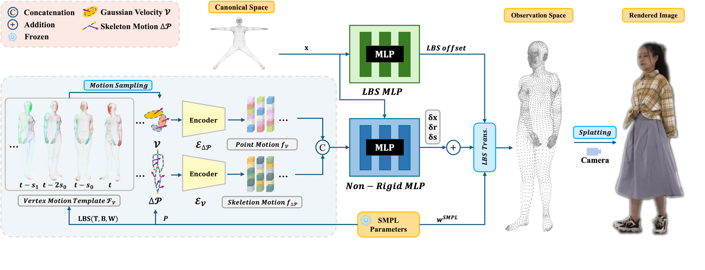

# 💃SeqAvatar

<h1 align="center">
  <a href="https://zezeaaa.github.io/projects/SeqAvatar/" style="text-decoration:none;">
    Sequential Gaussian Avatars with Hierarchical Motion Context
  </a>
</h3>

<h4 align="center">

[Wangze Xu<sup>1</sup>](https://zezeaaa.github.io/), [Yifan Zhan<sup>1,2</sup>](https://yifever20002.github.io/yifanzhan.github.io/), [Zhihang Zhong<sup>1</sup>](https://zzh-tech.github.io/),[Xiao Sun<sup>1</sup>](https://jimmysuen.github.io/)

<sup>1</sup>Shanghai Artificial Intelligence Laboratory, <sup>2</sup>The University of Tokyo


[](https://arxiv.org/pdf/2411.16768)
[](https://zezeaaa.github.io/projects/SeqAvatar/)

<h3 align="center">
  <a href="https://zezeaaa.github.io/projects/SeqAvatar/" style="text-decoration:none;">
    ICCV2025
  </a>
</h3>

<p align="center">
    
</p>

<p align="left"> 
SeqAvatar is a human avatar method based on sequential motion context. Details are described in our paper.
<p align="left"> 
📍 If there are any bugs in our code, please feel free to raise your issues.

## ⚙️ Setup
### 1. Recommended Environment
```bash
    # clone this repository
    git clone https://github.com/zezeaaa/SeqAvatar.git --recursive 
    # create environment
    conda env create -f environment.yaml
    conda activate seqavatar
```

### 2. SMPL Models Setup
#### SMPL
1.Download `SMPLIFY_CODE_V2.ZIP` from [SMPLify website](https://smplify.is.tue.mpg.de/). We use `smplify_public/code/models/basicModel_neutral_lbs_10_207_0_v1.0.0.pkl` inside for neutral gender. 

2.Follow [this page](https://github.com/vchoutas/smplx/tree/master/tools) to remove Chumpy objects from the SMPL model.

3.Copy and rename the modified `pkl` file to `./smpl_model/models/SMPL_NEUTRAL.pkl`

#### SMPLX
1.Download `models_smplx_v1_1.zip` from [SMPLX website](https://smpl-x.is.tue.mpg.de/). 

2.Copy `SMPLX_NEUTRAL.pkl`, `SMPLX_FEMALE.pkl`, and `SMPLX_MALE.pkl.pkl` to `./smpl_model/models/`

The folder structure should look like

```
./
├── ...
└── smpl_model/
    ├── models/
        ├── SMPL_NEUTRAL.pkl
        ├── SMPLX_NEUTRAL.pkl
        ├── SMPLX_FEMALE.pkl
        └── SMPLX_MALE.pkl.pkl
    ├── smpl/
    └── smplx/
```

---

## 🗂️ Datasets
### 1. I3D-Human Dataset
Download the dataset in `data/` folder from [this link](https://drive.google.com/drive/folders/1bj1pmr_FZE5ClR5ZCWpXD79ESaM8Ivvg?usp=sharing). Extract the data to `path/to/I3D-Human/`.

The folder structure should look like
```
<path/to/I3D-Human/>
├── ID1_1-novelpose/
    ├── images/
    ├── masks/
    ├── ...
├── ID1_1-novelview/
├── ID1_1-train/
├── ID1_2-novelpose/
├── ID1_2-novelview/
├── ID1_2-train/
├── ...
```

### 2. DNA-Rendering Dataset
Apply and download the dataset from [DNA-Rendering website](https://dna-rendering.github.io/inner-download.html). Extract the data to `path/to/DNA-Rendering/`. We use 6 sequences for our experiments: `0007_04`, `0019_10`, `0044_11`, `0051_09`, `0206_04`, and `0813_05`. Extract the data to `path/to/DNA-Rendering/`.

The folder structure should look like
```
<path/to/DNA-Rendering/>
├── 0007_04/
    ├── 0007_04.smc
    └── 0007_04_annots.smc
├── 0019_10/
├── ...
```

Then run the following script to extract necessary data for experiments.

```bash
python process_dnarendering.py --dna_root path/to/DNA-Rendering/ --output_root path/to/DNA-Rendering/ 
```

After processing, the folder structure should look like
```
path/to/DNA-Rendering/
├── 0007_04/
    ├── bkgd_masks/
    ├── cameras/
    ├── images/
    ├── model/
    ├── 0007_04.smc
    └── 0007_04_annots.smc
├── 0019_10/
├── ...
```

### ZJU-MoCap Dataset
Download the dataset from [this link](https://github.com/zju3dv/neuralbody/blob/master/INSTALL.md#zju-mocap-dataset). We use 6 sequences for our experiments:
`CoreView_377`, `CoreView_386`, `CoreView_387`, `CoreView_392`, `CoreView_393`, and `CoreView_394`.

Extract the dataset to `<path/to/ZJU-MoCap/>`, the folder structure should look like
```
<path/to/ZJU-MoCap/>
├── CoreView_377/
    ├── Camera_B1/
    ├── Camera_B2/
    └── ...
├── CoreView_386/
├── CoreView_387/
├── ...
```
---

## 📊 Experiments
### 1.I3D-Human Dataset
Training and evaluation on I3D-Human:
```bash
# set data_path as <path/to/I3D-Human/>
bash scripts/exps_i3dhuman.sh
```

### 2.DNA-Rendering Dataset
Training and evaluation on DNA-Rendering:
```bash
# set data_path as <path/to/DNA-Rendering/>
bash scripts/exps_dnarendering.sh
```

### 3.ZJU-Mocap Dataset
Training and evaluation on ZJU-MoCap:
```bash
# set data_path as <path/to/ZJU-MoCap/>
bash scripts/exps_zjumocap.sh
```

---
## 📚 Citation
If you find our work useful in your research please consider citing our paper:

```bibtex
@inproceedings{xu2025seqavatar,
  title={Sequential Gaussian Avatars with Hierarchical Motion Context},
  author={Xu, Wangze and Zhan, Yifan and Zhong, Zhihang and Sun, Xiao},
  booktitle={International Conference on Computer Vision (ICCV)},
  year={2025},
}
```

## 😊 Acknowledgement
Our code is heavily based on [GauHuman](https://github.com/skhu101/GauHuman), [Dyco](https://github.com/Yifever20002/Dyco), and [3DGS-Avatar](https://github.com/mikeqzy/3dgs-avatar-release). We would like to thank the authors for their great work and generously providing source codes, which inspired our work and helped us a lot in the implementation.